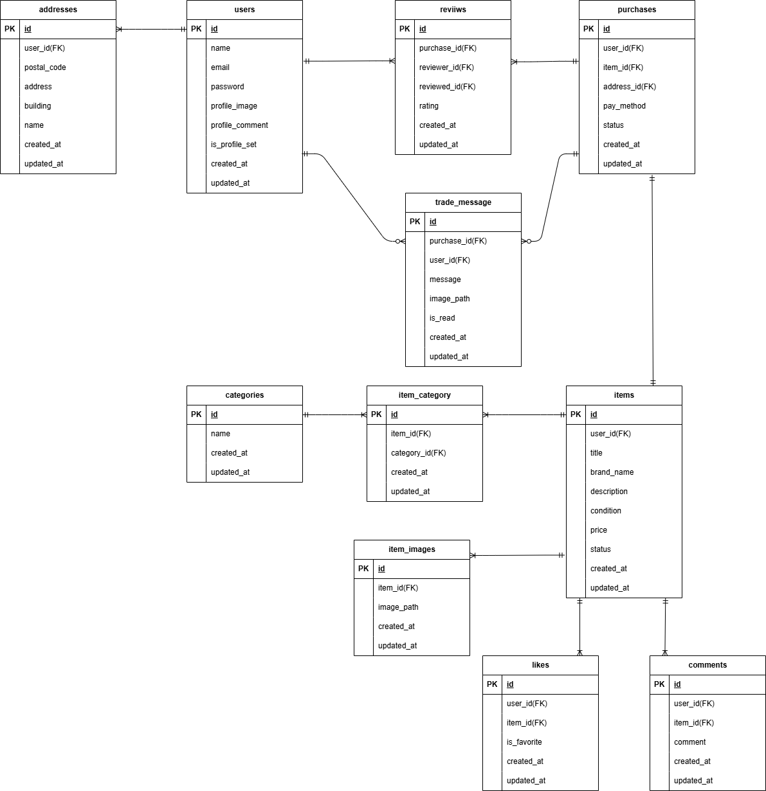

# FLEA-MAEKET

## 環境構築

### ① git clone

github よりソースを取得する

```
git clone https://github.com/yo003002/flea-market.git
```

階層を変更する

```
cd flea-market
```


### ② docker compose

`先ほど変更したフォルダ名がVSCodeのトップになっていることを必ず確認すること`


docker をインストールしていない場合は、使用中の PC に合わせてインストール
https://www.docker.com/get-started/

`docker compose up -d --build`

`docker compose exec php bash`

> **もし docker compose が動かない場合**
> docker-compose に読み替えて実行してみてください。


```
もし、
Project directory "/var/www/." is not empty.
というエラーが出たら、srcフォルダの中の .gitkeep は削除して、再度実行してください。
```

 Your requirements could not be resolved to an installable set of packages.　で弾かれた場合、下記のコードでblock-insecure を無効にして、再度ダウンロードする

`composer config --global audit.block-insecure false`

## パッケージのインストール
```
composer install
```

### ③ laravel の環境を修正


#### `.env` の作成・修正

```
cp .env.example .env
```

DB_HOST, DB_DATABASE, DB_USERNAME, DB_PASSWORD の値を変更

[](https://gyazo.com/2a9477db28b24ca194ac6e3d69aafd58)

#### mailhogの設定

MAIL_SCHEMEの削除　MAIL_ENCRYPTIONの追加　MAIL_MAILER・MAIL_HOST・MAIL_PORT　の値変更


### keyの作成
```
php artisan key:generate
```

### DATABASEの作成
```
php artisan migrate
```
```
php artisan db:seed
```

### storageの接続
```
php artisan storage:link
```

### .envにSTRIPEの設定を追加

#### stripe公式でダミー決済機能作成
- 以下のHPより登録してください

https://stripe.com/jp?utm_campaign=APAC_JP_JA_Search_Brand_Payments-Pure_PHR-581075585&utm_medium=cpc&utm_source=bing&utm_content=&utm_term=stripe&utm_matchtype=p&utm_adposition=&utm_device=c&msclkid=b31577ff44ac1b9e19bf1ea593aeac10

- STRIPE_SECRET=｛　ここは自身で設定してください　｝


### ④ laravel のテスト環境を作成

#### テスト用のデータベースを作成

[](https://gyazo.com/b10def21c9dfe7c0af503ac3671e9988)


#### .env.testing を編集
.env.testing ファイルの文頭部分にある APP_KEY を編集。

```
APP_NAME=Laravel
APP_ENV=test
- APP_KEY=xxxxxxxxx
+ APP_KEY=
APP_DEBUG=true
APP_URL=http://localhost
```

先ほど「空」にした APP_KEY に新たなテスト用のアプリケーションキーを加えるために以下のコマンドを実行

```
php artisan key:generate --env=testing
```

また、キャッシュの削除をしないと反映されなかったりするので、下記コマンドもコマンドラインで実行

```
php artisan config:clear
```

マイグレーションコマンドを実行して、テスト用のテーブルを作成

```
php artisan migrate --env=testing
```

## 使用技術
- PHP 8.4.14
- Laravel Framework 9.52.21
- nginx/1.21.1
- mysql from 11.8.3-MariaDB

## ER図
- 

## URL
- 開発環境　http://localhost/